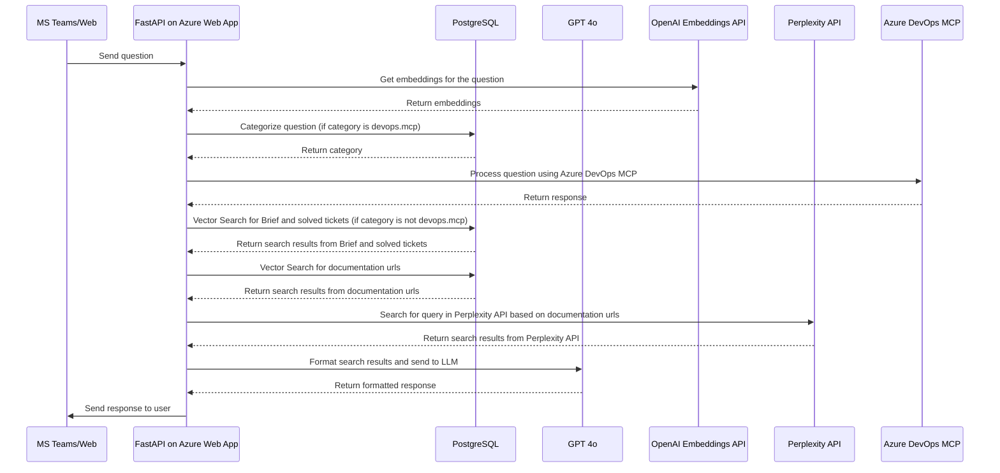

# William AI — AI-Powered Knowledge Query & Data Management Platform

## Overview
William AI is an advanced AI-first platform designed to help businesses query internal knowledge bases using natural language and manage client data through intuitive dashboards. It delivers powerful tools for both administrators and clients to interact with data in real time and make informed decisions.

---

## Problem Statement
The client required a unified system that could:
1. Provide an **intelligent chatbot** for querying curated knowledge bases.
2. Offer **admin and client dashboards** to manage data, update knowledge, and visualize insights without technical expertise.

The challenge was ensuring **scalability, security, and real-time responsiveness** across multiple platforms.

---

## Solution
Kcube AI developed **William AI** using a **hybrid AI search architecture** and enterprise-grade cloud deployment. The platform integrates **AI-powered querying** with **data visualization and management**, providing a seamless experience for both admin and client roles.

**Phase One** (4 sprints) is almost complete:
- **Sprint 4**: Fully delivered.
- **Sprint 3**: One task remaining (3 days left).

**Key Features:**
- AI chatbot integrated with **Perplexity API** and **OpenAI** for hybrid knowledge retrieval.
- **MCP Server** integration for modular, extendable communication.
- Enterprise-ready deployment via **Azure Web App** and **Azure Teams App**.
- Interactive dashboards built with **Next.js + TypeScript**.
- Real-time data visualization and easy content management.

---

## Tech Stack
| Technology      | Purpose |
|-----------------|---------|
| **Python**      | Backend logic & AI integration |
| **Next.js**     | Frontend framework for dashboards |
| **TypeScript**  | Type-safe frontend & backend code |
| **OpenAPI**     | API specification & documentation |
| **Perplexity**  | AI-powered search & knowledge retrieval |
| **Azure Web App** | Secure cloud deployment |
| **Azure Teams App** | MS Teams integration |
| **MCP Server**  | Modular communication layer |

---
## MCP Architecture

---

## User Flow Diagram

---
## Live Link
[🌐 William AI Web App](https://william-ai-webapp-dev.azurewebsites.net/)

---

**Developed by [Kcube AI](https://kcube.ai)**  
*AI Engineered for Excellence*
